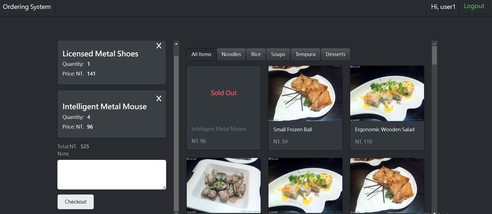
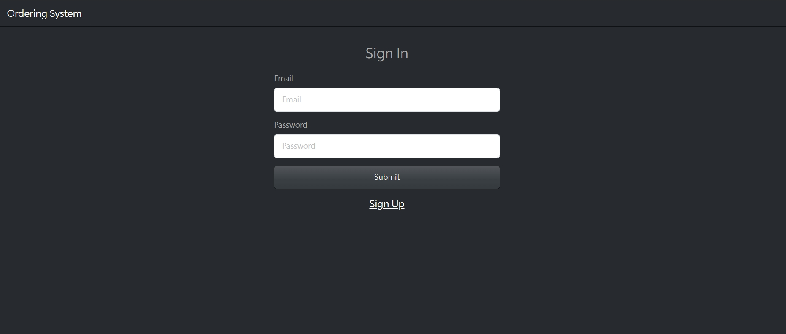
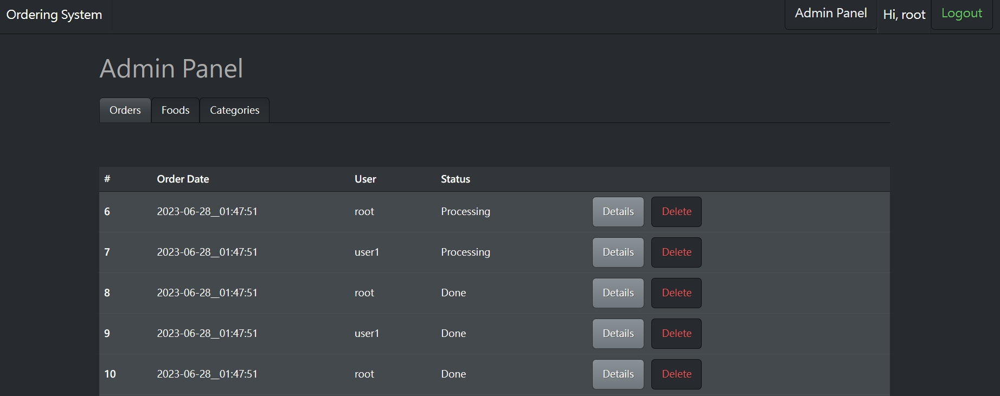
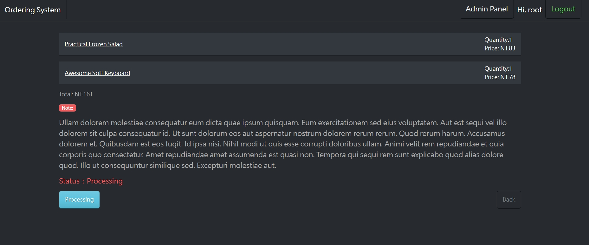
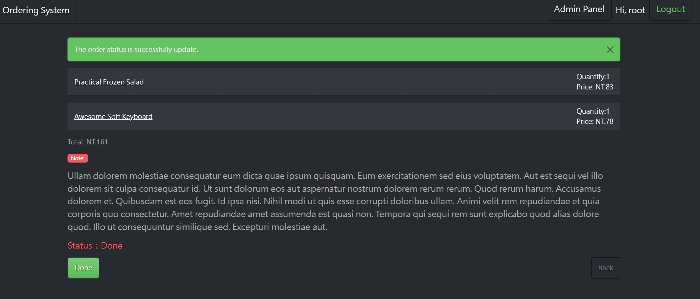
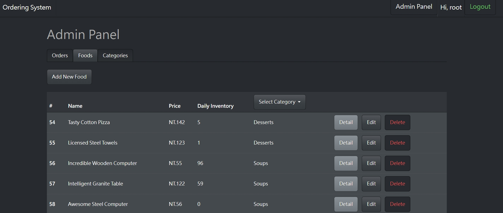
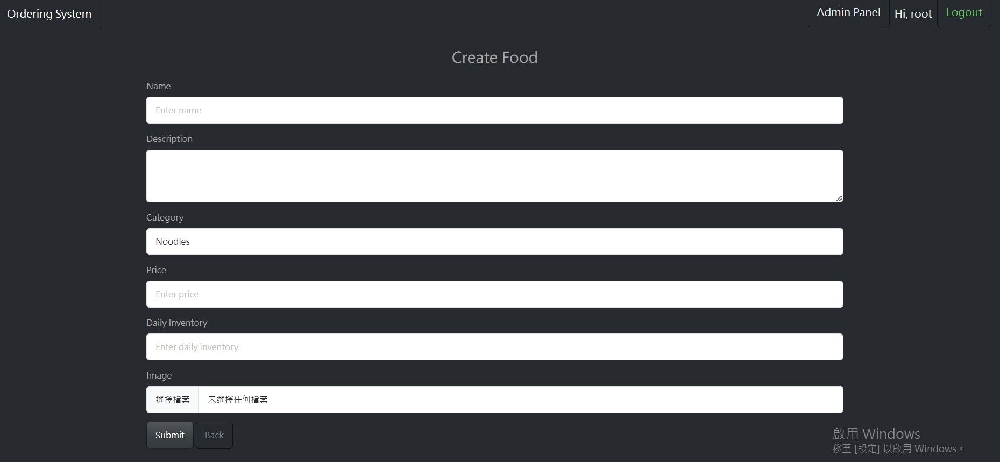
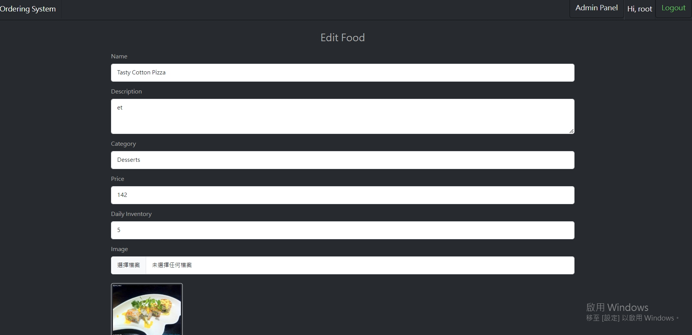
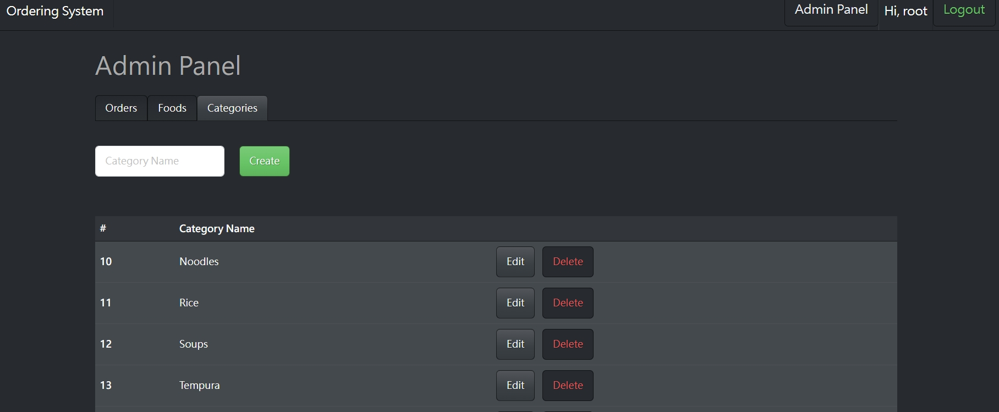
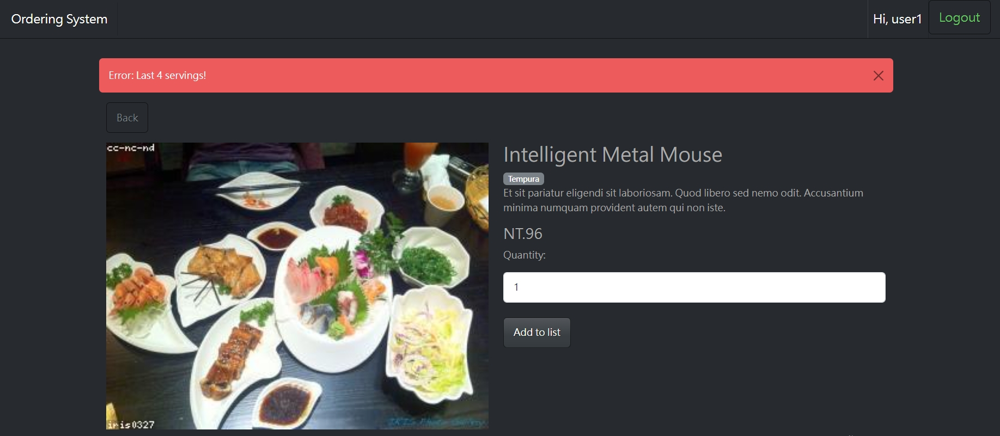

# Clothing Shop


## Introduction

This is an ordering system that rendering in real time. It'a simple and convenient. Reduce the need for manual intervention in the ordering process.

## Features

**Register/ Log in/ Log out**



**Admin Panel**

- Only administrators have permission to enter.
- On the orders page, admin can check the orders are "Processing" or "Done". Check the detail order can change the status of the order. 
- On foods page, admin can create a new food, edit the food or change the cover photo of food, delete the food. Also can select the category to check the food of the category.
- On the categories page, admin can create, edit, delete the category.

Admin Orders Page


Admin Foods Page


Admin Categories Page


**Customer**

- On the right side of the index page, choose food to add to list. According to the inventory of the food, a reminder will be displayed. 
- On the left side of the index page, customer can delete the food, take a note to retailer.




## Installation

1. Confirm you have already install the npm and node.js
2. Clone this repository
   ```
   https://github.com/JingYi120/ordering_system.git
   ```
3. Confirmed the terminal is at the project
   ```
   cd ordering_system
   ```
4. Project setup & Install nodemon
   ```
   npm install
   npm i nodemon
   ```
5. Create a `.env` file
   ```
   IMGUR_CLIENT_ID=
   ```
6. Create the database "ordering_system" in MySQL
   ```
   drop database if exists ordering_system;
   create database ordering_system;
   use ordering_system;
   ```
7. Create tables and seeders
   ```
   sequelize db:migrate
   sequelize db:seed:all
   ```
8. Start the server
   ```
   npm run dev
   ```
   It's successful that terminal show "Express is listening on http://localhost:3000"
9. You can use the account and password to log in and experience the website.:
   | Role | account  | password |
   | --- | --- | --- |
   | Admin | root@example.com.tw | 12345678 |
   | Customer | user@example.com.tw  | 12345678 |
10. stop server
    ```
    ctrl + c
    ```